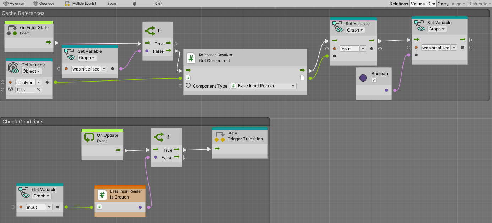

# Third-Person-Controller VERSION:alpha 0.1
DO NOT USE IN COMERCIAL PROJECTS without permisions


Third-Person-Controller is rigidbody character controller with statemachine based logic and custom Dependency Injection
<br/>

|                                       | Supported state machines|
|---------------------------------------|------------------      |
|Code State Machine                     |:heavy_check_mark:      |
|Visual scripting state machine         |:heavy_check_mark:      |
<br/>

|                        | Current States |
|------------------------|------------------
|Idle                    |:heavy_check_mark:
|Walk                    |:heavy_check_mark:
|Run                     |:heavy_check_mark:
|Sprint                  |:heavy_check_mark:
|Jump                    |:heavy_check_mark:
|Crouch                  |:heavy_check_mark:
|Prone                   |:heavy_check_mark:
|In Air                  |:heavy_check_mark:


<h6>Example: Creating custom Feature for state&nbsp;<i>Using Code</i></h6>

```csharp
using ThirdPersonController.Core.DI;
using ThirdPersonController.Core;
using UnityEngine;

public class ExampleFeature : BaseFeature
{
    [SerializeField] private float gravityValue = -10;
    
    private Rigidbody _rigidbody;
    
    public override void CacheReferences(IStateMachineVariables variables, IReferenceResolver resolver)
    {
      _rigidbody = resolver.GetComponent<Rigidbody>();
    }

    public override void OnEnterState() => Debug.Log("OnEnterState");

    public override void OnUpdateState() => Debug.Log("OnUpdateState");

    public override void OnFixedUpdateState() => _rigidbody.AddForce(Vector3.up * gravityValue, ForceMode.VelocityChange);

    public override void OnExitState() => Debug.Log("OnExitState");
}

```

<h6>Example: Creating custom Feature for state&nbsp;<i>Using Visual Scripting</i></h6>


<h6>Example: Creating custom Transition&nbsp;<i>Using Code</i></h6>
   
```csharp
using System;
using ThirdPersonController.Core.DI;
using ThirdPersonController.Core.CodeStateMachine;

public class GroundedStateTransition : BaseStateTransition
{
    public bool shouldBeGrounded;
    
    private IMoveStateMachineVariables _variables;
    public override void Initialise(IStateMachineVariables variables,IReferenceResolver resolver)
    {
        _variables = variables as IMoveStateMachineVariables;
    }

    public override bool couldHaveTransition => _variables.IsGrounded == shouldBeGrounded;
}
```

<h6>Example: Creating custom Transition&nbsp;<i>Using Visual Scripting</i></h6>
  


<br/> 


## Screenshots

<p align="center">	


</p>


<br/> 
Known issues:
<br/>
Bad arhitecture when input use IMoveStateMachineVariables inspector reference
<br/>
FootStep Feature lagging and code refactor
<br/>
Input processors code needs to pe improved
